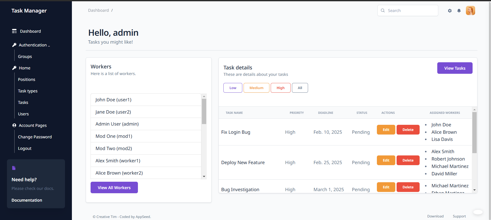
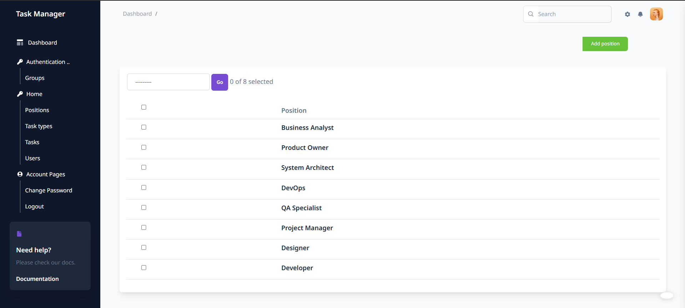
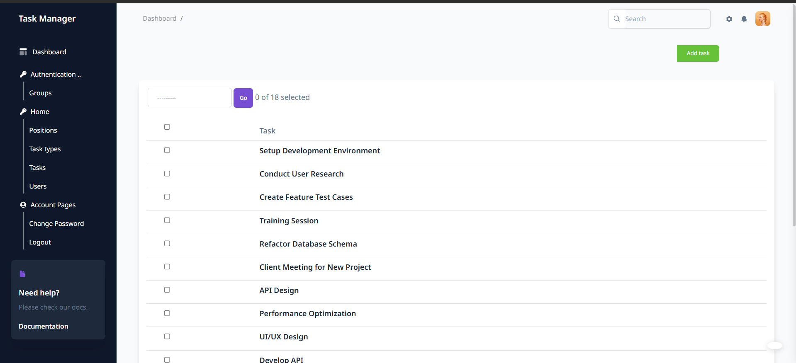
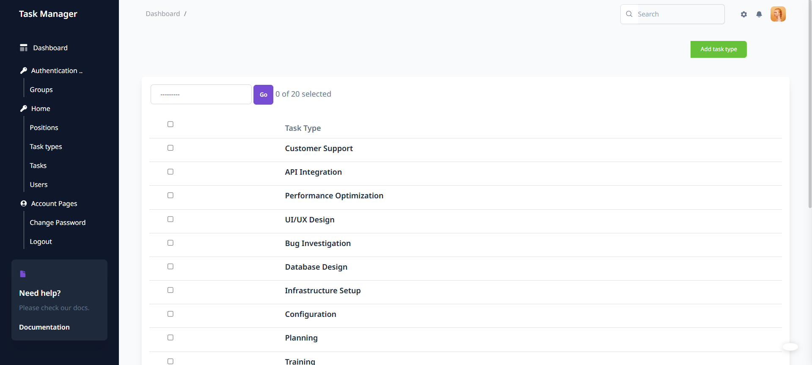
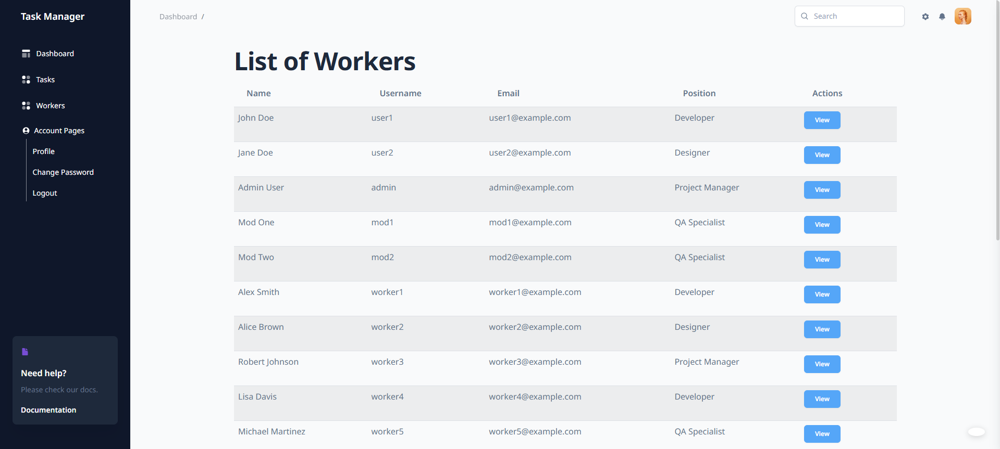

# Task manager
> Here will be a brif info about this project

This project is an implementation of task manager site where you can create/update tasks
and assign employees on it. Each employee can see only tasks assigned to him. 

## Fill with your own text
> A short preview of a project

Main page. Here you can see a list of workers and a list of tasks you can assign them for.


Positions. A list of you`re employees positions.


Tasks. A list of current tasks.


Task types. A list of available task types.


Worker list. A list of your current workers.


## Getting started

Fork this project and copy it to your PC:

```shell
git clone https://github.com/MindDevastation/task-manager.git
```


- Use the following command to load prepared data from fixture to test and debug your code:
  
`python manage.py loaddata task_manager_db_data.json`

- You can create your own superuser or use the following credentials:

Login: testadmin

Password(same for all creates users): test123